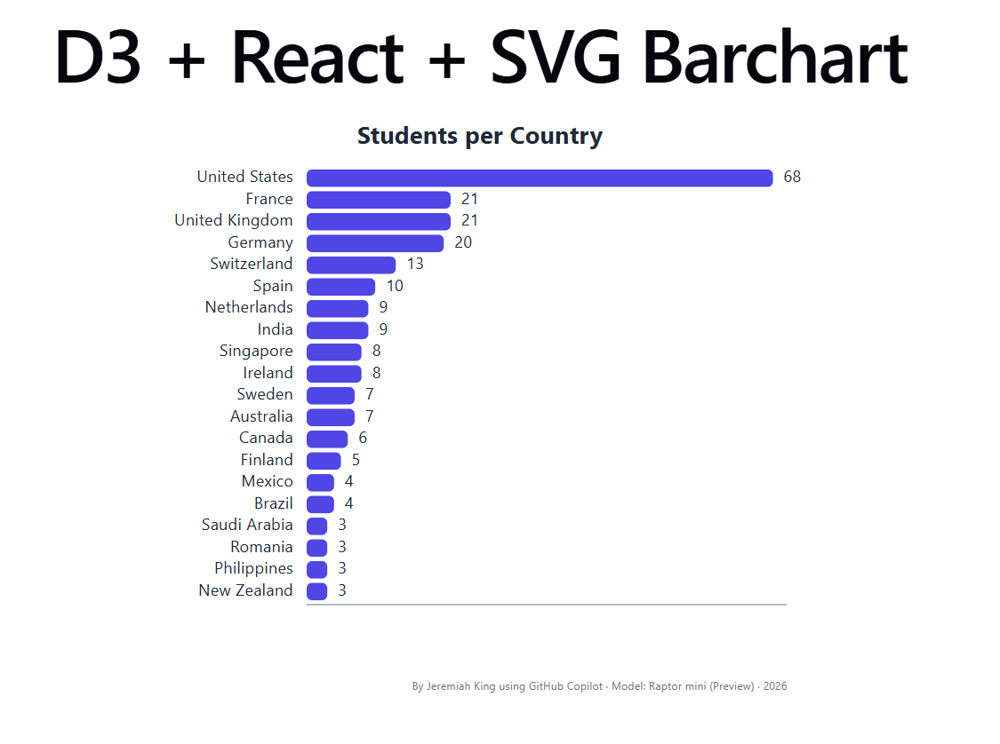

# D3 + React Barchart

An early D3 Loves React learning exercise building a horizontal SVG bar chart with D3 scales and React rendering. It was Jeremiah King's first from-scratch D3 chart in this course module.

## Live Demo

[View the chart on GitHub Pages](https://unguisdraconis.github.io/barchart/).



## Assignment Context

The course exercise asked learners to visualize supplied first-cohort country counts as a horizontal bar chart. D3 performs the scale and layout calculations, while React and JSX render the SVG rectangles and text. The assignment explicitly discouraged older D3 DOM-manipulation patterns such as `d3.select` and `d3.append` and encouraged using AI as a development aid.

In short: **D3 for the math, React for the rendering.**

## Data

The exercise supplied counts of students by country for the course's first cohort, described in the course material as limited to countries represented by more than three students. The supplied array nevertheless includes four countries with a count of 3; this project preserves all 20 hard-coded objects and their order unchanged.

The exercise supplied these aggregate counts; this repository does not document the underlying enrollment-data collection method or establish a separate reuse license for the dataset.

## What This Exercise Practiced

- Passing data into a React chart component
- `d3.scaleBand`, `d3.scaleLinear`, and `d3.max`
- SVG rectangles and text
- Chart margins and positioning
- A zero-based quantitative bar encoding
- React rendering rather than D3 DOM manipulation

## Jeremiah's Modifications

Beyond the basic chart requirements, Jeremiah adapted the visualization-specific colors for dark-mode presentation and added opacity-based hover emphasis. These were small, user-directed design experiments: the hovered country remains fully visible while the surrounding bars and labels dim.

## AI-Assisted Development

The assignment explicitly encouraged AI assistance. Jeremiah used Visual Studio Code's AI Toolkit with GitHub Copilot's Raptor Mini (preview) while working through the exercise. The application retains its original visible model credit; this context does not assign line-by-line authorship.

## Historical Limitations

This repository intentionally preserves its early learning-stage form: a fixed 500 × 400 SVG, simple embedded course data, limited interaction, no generalized responsive chart architecture, and no test suite or CI.

## Accessibility

The SVG has an accessible name and description. A visually hidden semantic table exposes the same 20 country/count pairs without changing the chart's visual presentation. Reduced-motion preferences disable the decorative opacity transitions.

## Local Use

```text
npm install
npm run dev
npm run build
```
